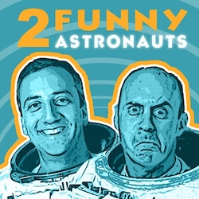

Mike Massimino, a former NASA astronaut, is a professor of mechanical engineering at Columbia University and the senior advisor for space programs at the Intrepid Sea, Air & Space Museum. He received a BS from Columbia University, and MS degrees in mechanical engineering and in technology and policy, as well as a PhD in mechanical engineering, from the Massachusetts Institute of Technology.

After working as an engineer at IBM, NASA, and McDonnell Douglas Aerospace, along with academic appointments at Rice University and at the Georgia Institute of Technology, Mike was selected as an astronaut by NASA in 1996, and is the veteran of two space flights, the fourth and fifth Hubble Space Telescope servicing missions in 2002 and 2009. Mike has a team record for the number of hours spacewalking in a single space shuttle mission, and he was also the first person to tweet from space. During his NASA career he received two NASA Space Flight Medals, the NASA Distinguished Service Medal, the American Astronautical Society’s Flight Achievement Award, and the Star of Italian Solidarity.

Mike has made numerous television appearances, including a six-time recurring role as himself on the CBS hit comedy _The Big Bang Theory_. He has hosted Science Channel’s _The Planets_ and its special _Great American Eclipse_. He is featured in National Geographic Channel’s series _One Strange Rock_ and is the host for Science Channel’s series _The Planets and Beyond_. He is a frequent guest on television news and talk show programs, including NBC’s _Today Show_, ABC’s _Good Morning America_, and CNN. He has also appeared on the _Late Show with David Letterman_ and the _Late Late Show with Craig Ferguson_, and on _StarTalk_ radio and television shows.

Mike’s book, _Spaceman: An Astronaut’s Unlikely Journey to Unlock the Secrets of the Universe_, has received rave reviews and is a _New York Times_ best-seller. Mike's new book, _Spaceman: The True Story of a Young Boy’s Journey to Becoming an Astronaut_, a young adult version of his previously published autobiography, is scheduled for publication on April 7th, 2020. He is a recipient of the 2017 Christopher Award, the 2017 Columbia University Community Impact Outstanding Community Service Award, the 2017 National Space Club Communications Award, and in 2018 was inducted into the Long Island Air and Space Hall of Fame. The street that Mike grew up on in Franklin Square, Long Island has been renamed “Mike Massimino Street.”

# Affiliations

## Columbia SEAS

Mike is a professor in Columbia University's engineering school, The Fu Foundation School of Engineering and Applied Science. For more information, please visit the [SEAS website](https://engineering.columbia.edu/).

## Intrepid Museum

Mike is the Senior Adviser for Space Programs at the Intrepid Sea, Air & Space Museum in New York City. There are some fantastic programs coming up on board, don't miss out! For more information, please visit the [Intrepid's website](https://www.intrepidmuseum.org/).

# Podcast

Podcast from Mike and his friend and fellow former astronaut Garrett Reisman. Enjoy their discussions about the bizarre, crazy, and surprising world of being 2 Funny Astronauts!

## Listen now

- [Apple Podcasts](https://podcasts.apple.com/us/podcast/2-funny-astronauts/id1565032832?uo=4&ls=1&at=11lEW&ct=sczdx8)
- [Spotify](https://open.spotify.com/show/5WTiPHCLmm58LRBVX6bQjd)
- [Youtube](https://www.youtube.com/channel/UCb6VG031XF9lZAg1tGq548A)
- [Google Podcasts](https://podcasts.google.com/feed/aHR0cHM6Ly8yZnVubnlhc3Ryb25hdXRzLmNvbS9mZWVkLnhtbA)
- [Podbean](https://2funnyastronauts.com/)

